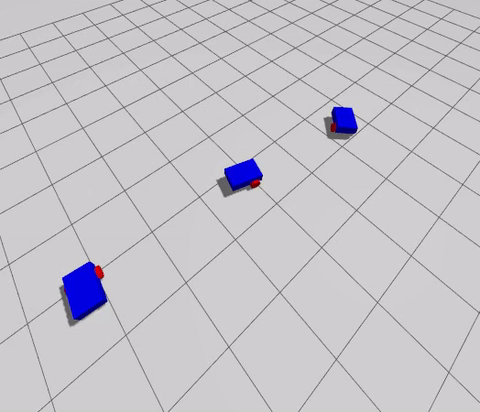
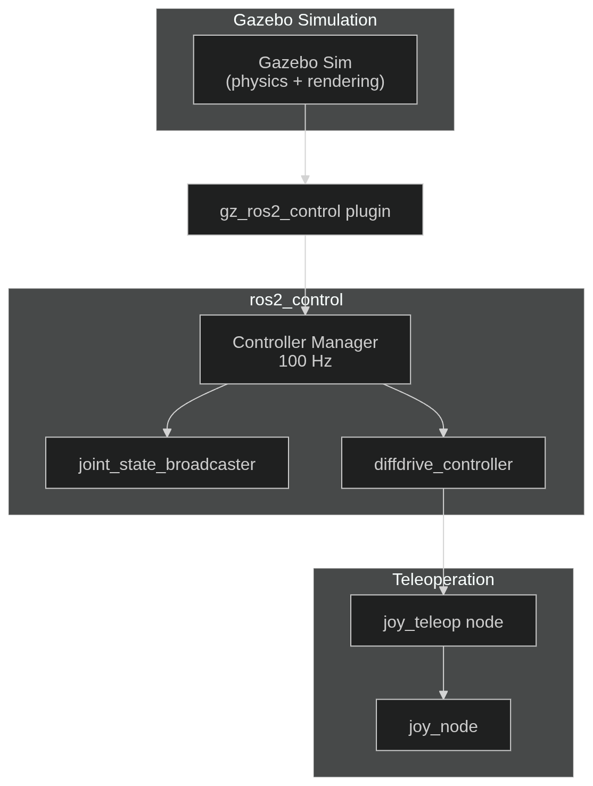

# Project Zoomlet

A ROS 2 differential drive robot simulation built with Gazebo and ros2_control. Supports multi-robot spawning, joystick teleoperation, and both ROS 2 Humble and Jazzy distributions.


---


## Overview

Zoomlet is a minimal but complete mobile robot stack built on ROS 2 and `ros2_control`. It is designed as a clean reference for differential drive robots - covering URDF modeling, physics-tuned Gazebo integration, controller configuration, and joystick teleoperation - with first-class support for **multi-robot namespacing**.

## Demo
### Gazebo Simulation
<p align="center">
  
</p>

---
## Packages

| Package | Description |
|---|---|
| `zoomlet_description` | URDF/xacro robot model, RViz config, spawn launch files |
| `zoomlet_controller` | ros2_control config, diff drive + velocity controllers, joystick teleop |
| `zoomlet_simulation` | Gazebo world and multi-robot spawn launch files |

## Robot Specs

| Parameter | Value |
|---|---|
| Base dimensions | 0.6 m × 0.4 m × 0.2 m |
| Base mass | 3.5 kg |
| Wheel radius | 0.1 m |
| Wheel separation | 0.5 m |
| Wheel mass | 0.3 kg each |
| Caster radius | 0.05 m |
| Max linear velocity | 0.46 m/s |
| Max angular velocity | 1.9 rad/s |
| Max linear acceleration | 0.9 m/s<sup>2</sup> |
| Max angular acceleration | 7.725 rad/s<sup>2</sup> |

---

## Dependencies

### System Requirements
- **Ubuntu 22.04 LTS**/ 
- **ROS 2 Humble Hawksbill**
- **Gazebo Ignition** 
- **colcon** build system


### Install Dependencies
```bash
sudo apt install -y ros-humble-xacro \
                                    ros-humble-rviz2 \ 
                                    ros-humble-ros_gz_sim \ 
                                    ros-humble-robot_state_publisher \ 
                                    ros-humble-joint_state_publisher \ 
                                    ros-humble-joint_state_publisher_gui \ 
                                    ros-humble-ros_gz_bridge \
                                    ros-humble-gz_ros2_control \
                                    ros-humble-diff_drive_controller \ 
                                    ros-humble-joint_state_broadcaster \ 
                                    ros-humble-velocity_controllers \
                                    ros-humble-joy \ 
                                    ros-humble-joy_teleop 
```


## Architecture
<p align="center">
  
</p>


## Build

1. Clone Repository
```bash
mkdir -p ~/zoomlet_ws/src
cd ~zoomlet_ws/src
git clone <repositor url> # TODO: update URL.
```

2. Build 
```bash
cd ~/zoomlet_ws
colcon build
source install/setup.bash
```

## Usage

### Full simulation (spawn multiple robots)

Launches a Gazebo world and spawns three Zoomlet robots at different positions, each with its own namespaced controller stack and RViz window.

```bash
ros2 launch zoomlet_simulation gz_sim.launch.py
```

### Single robot

```bash
ros2 launch zoomlet_simulation gz_spawn.launch.py \
namespace:=zoomlet4 \
x:=4.0 y:=0.0
```

### URDF preview in RViz

```bash
ros2 launch zoomlet_description simple_rviz.launch.py
```

### Joystick teleoperation

```bash
ros2 launch zoomlet_controller joy_teleop.launch.py \
namespace:=zoomlet1
```

Hold **RB (button 5)** as the deadman switch.  
- **Left stick Y-axis** -> linear velocity  
- **Right stick X-axis** -> angular velocity

Commands are published as `geometry_msgs/TwistStamped` to `<namespace>/diffdrive_controller/cmd_vel`.


## Controllers

Managed by `ros2_control` at 100 Hz, using sim time from Gazebo.

| Controller | Type | Topic |
|---|---|---|
| `joint_state_broadcaster` | `JointStateBroadcaster` | `/joint_states` |
| `diffdrive_controller` | `DiffDriveController` | `<ns>/diffdrive_controller/cmd_vel` |
| `simple_velocity_controller` | `JointGroupVelocityController` | - |

Odometry is published to `<ns>/diffdrive_controller/odom` with the `odom` -> `base_footprint` TF frame.

---

## Future Work

- [ ] **Sensor integration** - add a 2D LiDAR (RPLidar / simulated) and IMU sensor.
- [ ] **SLAM** - integrate `slam_toolbox` for online mapping with the LiDAR
- [ ] **Navigation** - bring up `nav2` stack (costmaps, planners, recovery behaviors)
- [ ] **Multi-robot coordination** - centralized task allocation for the two-robot setup
- [ ] **Arm attachment** - mount a simple manipulator arm on the base for pick-and-place tasks
- [ ] **CI** - add colcon build + `ament_lint` checks in GitHub Actions

---

## License

MIT
